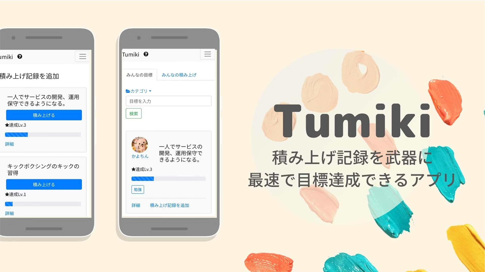
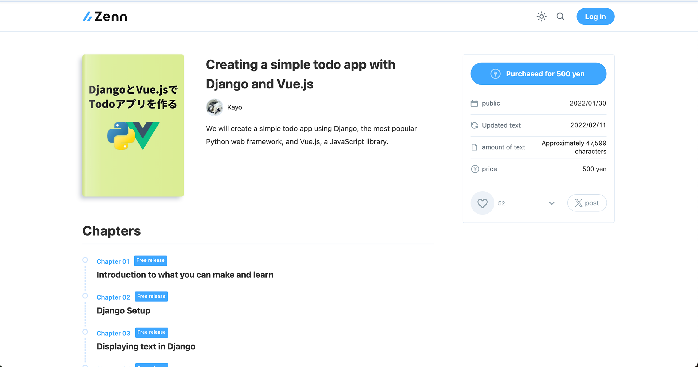

# Hi, I'm Kayo 👋  
🧑‍💻 Web Developer & Designer with 5 years of experience  

---

## 🛠 Tech Stack
**Languages & Frameworks:** Ruby (Rails), Python, JavaScript (Vue.js, React.js), HTML, CSS, SQL (MySQL, PostgreSQL)  
**Cloud & DevOps:** AWS, Google Cloud, Docker  
**Design & Tools:** Figma, Adobe Creative Suite, WordPress  

---

## 🌱 Side Projects

### **Tumiki**  
A web application to set goals and to-dos. Users can view others' goals for motivation and inspiration.  

### **AI Fitting**  
An app that allows users to simulate “trying on clothes” online by uploading their image and clothing items. Built with OpenCV for image processing.  

---

## 📚 Online Book
My book on creating apps with Python and JavaScript has been sold to over 50 users on Japanese platforms **Zenn** and **note**.  

---

## 🎥 YouTube Channel
I organize a YouTube channel for programming beginners, sharing tutorials on portfolio creation, programming languages, book summaries, and career advice for engineers. Over 2,000 subscribers.  

## 🎨 Portfolio
Check out my design work and case studies here: [My Portfolio](https://kayofujii.studio.site)

---

## ⚡ Fun Fact
I love creating products that combine design, development, and real-world impact. Always learning and experimenting with new ideas!
