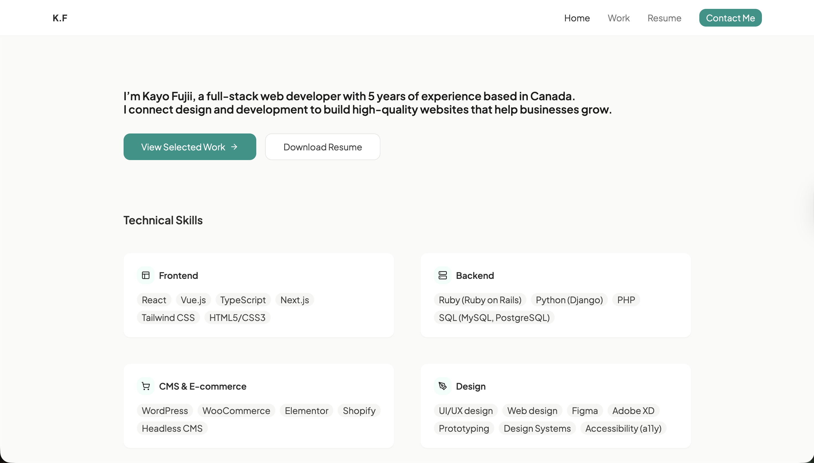
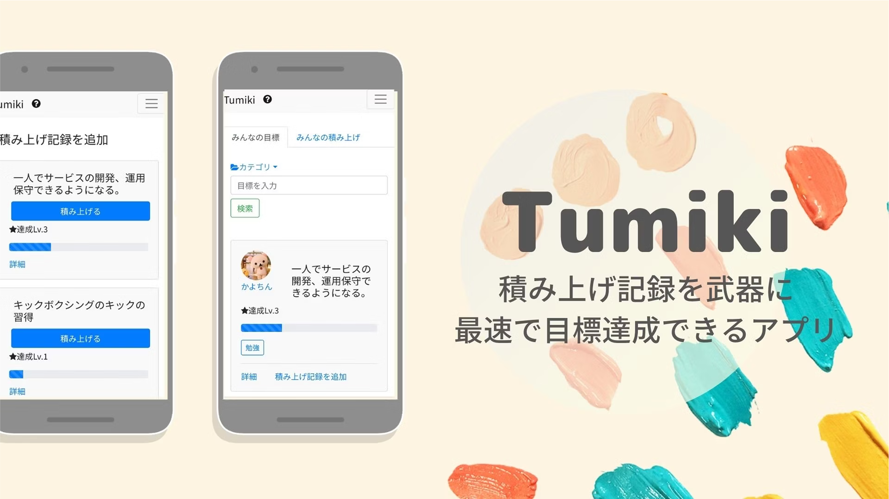
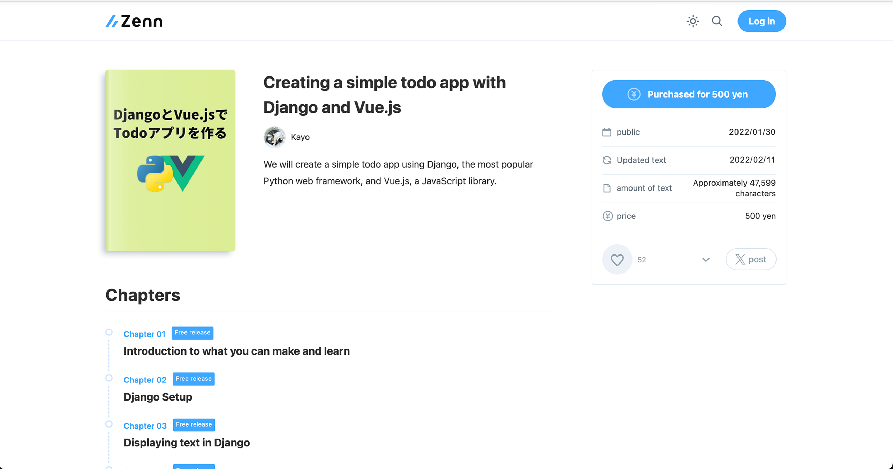

# Hi, I'm Kayo 👋  
🧑‍💻 Web Developer & Designer with over 5 years of experience  

## 🛠 Tech Stack
**Languages & Frameworks**
- Ruby (Rails), Python, PHP  
- JavaScript (Vue.js, React.js, Next.js, Node.js, jQuery)  
- HTML/CSS, SQL (MySQL, PostgreSQL), Liquid  

**Cloud & DevOps**
- AWS, Google Cloud, Docker, Vercel, GitHub  

**Testing & QA**
- Cypress, RSpec, Playwright, Postman  
- Test automation, manual testing  

**CMS & E-commerce**
- WordPress, WooCommerce, Elementor  
- Shopify, Contentful, Headless CMS  

**Design & Tools**
- Figma, Adobe Creative Suite, Canva  

**UX & UI Design**
- User research, usability testing  
- Wireframing, prototyping, mockups  
- Design systems, responsive design  
- Accessibility (WCAG), user-centered design  

**Marketing & Analytics**
- SEO, GA4, CRO (conversion rate optimization)  
- Copywriting, product photography  

## 🎨 Portfolio

  

Check out my work here: [Portfolio](https://kayofujii.vercel.app/).

## 🌱 Side Projects

### [Tumiki](https://github.com/kayofujii/goal_tree)
A web application to set goals and to-dos. Users can view others' goals for motivation and inspiration.  

  

## 📚 Online Book
My book on creating apps with Django(Python) and Vue.js has been sold to over 50 users on Japanese platforms [Zenn](https://zenn.dev/fujiikayo/books/fc501522bcff6e) and [note](https://note.com/kcatyo/m/mc4a622868c73).  

  

## ⚡ Fun Fact
I love creating products that combine design, development, and real-world impact. Always learning and experimenting with new ideas!
